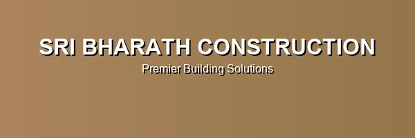

# Sri Bharath Construction - Official Website

🏗️ **Premium Construction Company Website** - A modern, responsive website showcasing 20+ years of construction excellence in Chennai.



## 🌟 Features

### ✨ **Modern Design & UX**
- **Responsive Design** - Mobile-first approach, works perfectly on all devices
- **Smooth Animations** - AOS (Animate On Scroll) library integration
- **Interactive Elements** - Hover effects, transitions, and micro-interactions
- **Fast Loading** - Optimized images and performance-focused architecture

### 🎨 **Visual Excellence**
- **Professional Color Scheme** - Gold & dark theme representing luxury construction
- **High-Quality Images** - 60+ professional construction and project images
- **Modern Typography** - Inter font family for clean, readable text
- **Organized Layout** - Clean section-based structure

### 🔧 **Technical Features**
- **Modular CSS Architecture** - Organized into components, layout, animations, and responsive files
- **ES6+ JavaScript** - Modern JavaScript with module-based architecture
- **SEO Optimized** - Meta tags, semantic HTML, and search engine friendly
- **Accessibility** - ARIA labels, keyboard navigation, and screen reader support
- **Performance Optimized** - Lazy loading, debounced events, and efficient code

## 📁 Project Structure

```
sri-bharath-construction/
├── assets/
│   ├── css/
│   │   ├── main.css           # Main CSS entry point
│   │   ├── variables.css      # CSS custom properties
│   │   ├── base.css          # Reset and base styles
│   │   ├── components.css    # Reusable components
│   │   ├── layout.css        # Page structure and navigation
│   │   ├── animations.css    # Keyframes and transitions
│   │   └── responsive.css    # Mobile-first responsive design
│   ├── js/
│   │   ├── main.js           # Main JavaScript entry point
│   │   └── modules/
│   │       ├── header.js     # Navigation functionality
│   │       ├── animations.js # Animation controller
│   │       ├── interactive.js# Interactive elements
│   │       ├── performance.js# Performance optimizations
│   │       ├── theme.js      # Theme switching
│   │       └── search.js     # Search and filtering
│   └── images/
│       ├── backgrounds/      # Background images
│       ├── icons/           # Icon images
│       ├── projects/        # Project showcase images
│       ├── services/        # Service category images
│       ├── team/           # Team photos
│       └── *.jpg           # Main section images
├── docs/                    # Documentation
├── index.html              # Main HTML file
├── README.md               # This file
├── LICENSE                 # License file
└── .gitignore             # Git ignore rules
```

## 🚀 Getting Started

### Quick Start
1. **Clone the repository**
   ```bash
   git clone https://github.com/yourusername/sri-bharath-construction.git
   cd sri-bharath-construction
   ```

2. **Open in browser**
   ```bash
   # Open index.html in your preferred browser
   open index.html
   # or
   python -m http.server 8000  # For local development server
   ```

3. **Start developing**
   - Edit HTML in `index.html`
   - Modify styles in `assets/css/`
   - Update JavaScript in `assets/js/`

### Development Setup
For local development with live reload:

```bash
# Using Live Server (VS Code extension)
# or using Node.js live-server
npx live-server
```

## 📱 Responsive Breakpoints

| Device | Breakpoint | Layout |
|--------|------------|--------|
| Mobile | < 768px | Single column, stacked layout |
| Tablet | 768px - 992px | Two column layout |
| Desktop | 992px - 1200px | Three column layout |
| Large Desktop | > 1200px | Full grid layout |

## 🎨 Design System

### Colors
```css
--primary-color: #d4a574;    /* Gold */
--primary-dark: #b8935c;     /* Dark Gold */
--secondary-color: #2c2c2c;  /* Dark Gray */
--accent-color: #6b5d4f;     /* Brown */
```

### Typography
- **Font Family**: Inter (Google Fonts)
- **Weights**: 300, 400, 500, 600, 700, 800, 900
- **Scale**: Responsive typography with clamp()

## 📋 Sections Overview

### 🏠 **Home/Hero Section**
- Company branding and main hero image
- Animated company name
- Call-to-action buttons

### 📊 **Statistics Section**
- 4 key metrics with animated counters
- Years of experience, projects completed, happy clients

### 🔧 **Services Section**
- 6 service categories with images and descriptions
- Residential, Commercial, Structural Engineering, Quality Assurance
- Interactive service cards with hover effects

### 🏢 **Projects Section**
- Featured project showcases
- Project categories (Residential, Commercial, Industrial)
- Project details and completion dates

### 📞 **Contact Section**
- Contact form with validation
- Company contact information
- Working hours and location

### 📋 **Footer**
- Quick links and services
- Contact information
- Copyright and company details

## 🛠️ Technologies Used

### Frontend
- **HTML5** - Semantic markup
- **CSS3** - Modern styling with custom properties
- **JavaScript (ES6+)** - Modern JavaScript features
- **Font Awesome** - Icons
- **Google Fonts (Inter)** - Typography

### Libraries
- **AOS (Animate On Scroll)** - Scroll animations
- **Modern CSS Grid & Flexbox** - Layout

### Tools
- **Modular Architecture** - Organized code structure
- **CSS Custom Properties** - Design system
- **ES6 Modules** - JavaScript organization

## 🔧 Browser Support

| Browser | Version |
|---------|---------|
| Chrome | 60+ |
| Firefox | 60+ |
| Safari | 12+ |
| Edge | 79+ |

## 📈 Performance Features

- **Image Optimization** - Lazy loading and optimized formats
- **CSS Optimization** - Modular CSS architecture
- **JavaScript Optimization** - ES6 modules and efficient event handling
- **Performance Monitoring** - Built-in performance utilities

## 🤝 Contributing

1. Fork the repository
2. Create a feature branch (`git checkout -b feature/amazing-feature`)
3. Commit your changes (`git commit -m 'Add amazing feature'`)
4. Push to the branch (`git push origin feature/amazing-feature`)
5. Open a Pull Request

## 📄 License

This project is licensed under the MIT License - see the [LICENSE](LICENSE) file for details.

## 📞 Contact

**Sri Bharath Construction**
- 📍 Location: OMR, Chennai, Tamil Nadu, India
- 📞 Phone: +91 98403 36793 / +91 90801 52531
- 🌐 Website: [sribharathconstruction.com](#)

## 🙏 Acknowledgments

- **Images**: Professional construction and architectural images
- **Icons**: Font Awesome icon library
- **Fonts**: Google Fonts (Inter family)
- **Animations**: AOS library for scroll animations

---

**Built with ❤️ by Sri Bharath Construction Team**

*Building dreams and creating architectural masterpieces since 2004*